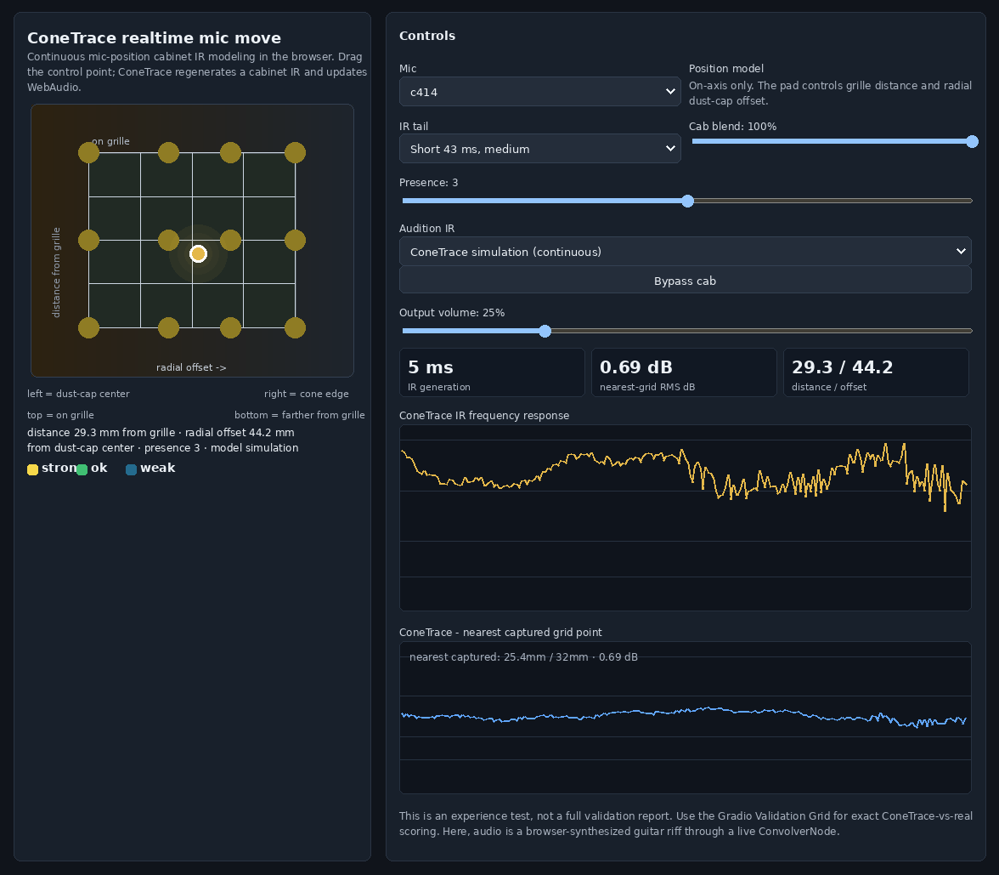

# ConeTrace

**Continuous mic-position cabinet IR modeling.**

ConeTrace is a neural guitar **cabinet IR approximation** for VesselDSP: train a
model on labeled public IR packs, then *generate* a `.wav` impulse response for
any supported (cab, speaker, mic, position) — including positions never
captured — and audition mic movement live.

The current release checkpoint is:

```text
conetrace-godscab-v0.1
runs/real_pcond_h256/best.pt
```



## Data Credits

ConeTrace v0.1 was trained and validated primarily against the **God's Cab**
public cabinet IR pack, using the 48 kHz close-mic Mesa Oversized Rectifier
4x12 grid. Those captures provide the release checkpoint's supported controls:
mic, grille distance, radial dust-cap offset, and presence.

The ingest tools also cover **Overdriven SSP2-series** packs for broader parser
and labeling coverage. **TONE3000** is used only as a small, manually approved
external validation probe in this repo; it is not part of the v0.1 training set.

Raw third-party IR packs, downloaded TONE3000 files, and captured reference
audio are not redistributed here. Please follow each original dataset or pack
license/terms. The MIT license in this repository covers ConeTrace source code
and documentation, not third-party audio captures.

## GitHub Pages Demo

The public realtime demo lives at [docs/index.html](docs/index.html). Configure
GitHub Pages to serve from the repository's `/docs` folder.
The included GitHub Actions workflow publishes `docs/` automatically on pushes
to `main`; after deployment, the ONNX/WASM page is available at
`https://<owner>.github.io/<repo>/wasm.html`.

Build it with:

```bash
python3 scripts/build_realtime_demo.py \
  --ckpt runs/real_pcond_h256/best.pt \
  --public-page \
  --out docs/index.html
```

The public page embeds the release model weights but **does not embed captured
reference IRs or raw third-party audio**. The local development build can still
include reference IR comparison:

```bash
python3 scripts/build_realtime_demo.py \
  --ckpt runs/real_pcond_h256/best.pt \
  --out app/realtime.html
```

An ONNX export and browser WASM runtime are also included:

```bash
# export verification requires torch, onnx, and onnxruntime
python3 scripts/export_onnx.py \
  --ckpt runs/real_pcond_h256/best.pt \
  --out docs/assets/conetrace-godscab-v0.1.onnx \
  --metadata-out docs/assets/conetrace-godscab-v0.1.onnx.json

python3 scripts/build_onnx_wasm_demo.py \
  --metadata docs/assets/conetrace-godscab-v0.1.onnx.json \
  --out docs/wasm.html
```

Open [docs/wasm.html](docs/wasm.html) to test the same checkpoint through ONNX
Runtime Web/WASM. It fetches the ONNX model from
`docs/assets/conetrace-godscab-v0.1.onnx` and does not include captured
reference IRs.

```
cab-ir-lab/
├── docs/design.md      # full project design: data, model, inference, UI, capture theory
├── data/
│   ├── raw/            # drop downloaded IR packs here (gitignored — license)
│   ├── parsed/         # ingest output: labels.parquet + irs.npy + coverage.md (gitignored)
│   └── parsers/        # per-pack filename→label parsers (God's Cab, Overdriven, Redwirez, TONE3000)
├── cabir/              # python package
│   ├── labels.py       # label schema + token-based filename parser + coverage report
│   ├── ingest.py       # raw packs → normalized labels.parquet + irs.npy  (M1)
│   ├── synth.py        # synthetic IR generator (smoke pipeline, no downloads)
│   ├── model.py        # conditional spectral decoder
│   ├── train.py        # training entrypoint
│   ├── infer.py        # checkpoint + condition → IR .wav
│   ├── dsp.py          # min-phase reconstruction, resampling, onset/windowing
│   └── dataset.py      # torch Dataset over parsed IRs
├── scripts/            # build/release, ONNX/WASM, validation, ABX, and TONE3000 helpers
├── app/                # gradio_app.py; realtime.html is a local ignored build
├── docs/               # model card, design notes, and GitHub Pages realtime demo
└── exports/            # generated .wav IRs
```

## License

ConeTrace source code and documentation are licensed under the
[MIT License](LICENSE.md).

Third-party/raw IR packs, downloaded TONE3000 files, generated training
artifacts, non-release checkpoints, and listening-test outputs are **not**
committed and may have their own terms. The GitHub Pages app
([docs/index.html](docs/index.html)) intentionally embeds the release model
weights, but not captured reference IRs or raw third-party audio. Keep raw audio
and generated artifacts local unless their license explicitly allows
redistribution.

## Quickstart (zero downloads — synthetic smoke pipeline)

Everything below runs on numpy/scipy only (no PyTorch, no datasets, <20 MB disk):

```bash
python3 -m cabir.train                # train conditional spectral decoder (~30s CPU)
python3 -m cabir.infer --mic dyn57 --distance 25 --offset 30   # -> exports/*.wav
python3 scripts/build_demo.py         # -> app/demo.html (single file, open in browser)
```

`app/demo.html` is fully self-contained: model weights baked in, forward pass +
min-phase reconstruction in JS, Karplus-Strong guitar riff through a WebAudio
ConvolverNode. Drag the mic across the speaker and hear the position change.

Smoke results (synthetic cab, 128 held-out positions): model **0.83 dB** log-spectral
distance vs **1.86 dB** for the nearest-captured-IR baseline.

## Real-data prep (Workstream 1 / M1)

The ingest pipeline is built, self-tested, and has run on **12 packs →
1,159 labeled IRs** (God's Cab 659 + 11 Overdriven SSP2-series packs 500).
**M1 milestone cleared.** Raw IRs are training inputs only and stay out of git
(license — see [data/raw/README.md](data/raw/README.md)).

```bash
# 1. download a pack and unzip into its own folder under data/raw/
# 2. normalize + label everything:
python3 -m cabir.ingest          # -> data/parsed/{labels.parquet, irs.npy, coverage.md}
python3 scripts/selftest_ingest.py   # verify the pipeline on synthetic fixtures (no downloads)
```

Per file: filename → label (`cabir/labels.py`; a pack supplies a declarative
`PackConfig` and, if its grammar is rich, a custom `parse()` — unparseable files
are **quarantined**, never guessed) and audio → mono → 48 kHz → onset-align →
4096 taps → windowed → unit-energy float32. Path filters skip duplicate
sample-rate copies and hardware dumps before parsing. Output is `labels.parquet`
(schema: `pack, cab, speaker, mic, distance_mm, distance_ref, offset_mm,
angle_deg, axis, capture_type, ts, presence, …`) row-aligned with `irs.npy`,
plus a per-(cab, mic) `coverage.md` grid showing dense vs sparse coverage.

Ingest is **lossless**: every documented label dimension is recorded. God's Cab,
for example, captures 5 power-amp `presence` settings × 2 `ts` (Tube-Screamer)
states per (mic, distance, position), so each close-mic cell holds 10 IRs — for
the 4-D conditioning `(mic, distance, offset, angle)` either filter to one
`(ts=False, presence)` in the dataset loader or add them as conditioning inputs
(see `coverage.md`). `--minphase` stores the min-phase target (sets `is_minphase`)
for A/B against raw-phase.

## Real-data inference

The real PyTorch checkpoint path is wired up:

```bash
python3 -m cabir.infer --ckpt runs/real_pcond_h256/best.pt --mic sm57 \
  --distance 25 --offset 32 --angle 0 --out exports/sm57_real.wav
```

Real training defaults to one God's Cab presence setting so the 4-D conditioning
does not map one position to multiple brightness targets:

```bash
python3 -m cabir.train --real --presence 3
```

The current best Python/Gradio checkpoint conditions on God's Cab `presence` and
trains on all five presence settings:

```bash
python3 -m cabir.train --real --condition-presence --hidden 256 \
  --out runs/real_pcond_h256
```

Training supports light conditioning augmentation and edge weighting:

```bash
python3 -m cabir.train --real --presence 3 --hidden 256 \
  --offset-jitter-mm 4 --distance-jitter-mm 3 \
  --edge-weight 2 --edge-weight-offset-mm 80
```

In the current small God's Cab grid, augmentation is a tradeoff: edge weighting
slightly improves worst cone-edge cells, but the plain hidden-256 checkpoint has
the best average validation error, so it remains the default.

Launch the in-repo audition UI:

```bash
python3 app/gradio_app.py --ckpt runs/real_pcond_h256/best.pt
```

The UI includes a built-in test-audio dropdown populated from
`data/test_audio/inputs/`; uploaded DI clips override the selected test clip.
It has separate **Normal render** and **Mic sweep** tabs. Normal render and
sweep render both include average spectrum delta plots and original-vs-rendered
spectrograms. The **Model vs real** tab compares one generated IR to the nearest
captured IR. The **Validation grid** tab scores every captured position for the
selected mic and shows where the model is strongest or weakest. The delta plot
is usually the easiest view: red means boosted, blue means reduced.

Build and serve the browser-native realtime mic-move test:

```bash
python3 scripts/build_realtime_demo.py --ckpt runs/real_pcond_h256/best.pt --out app/realtime.html
python3 -m http.server 8000
```

Then open `http://127.0.0.1:8000/app/realtime.html`. This page embeds the
presence-conditioned checkpoint, runs the spectral decoder in JavaScript, and
updates a WebAudio `ConvolverNode` while you drag the mic. Use the **IR tail**
menu to compare full 85 ms, short 43 ms, and tight 21 ms windows; if roominess
disappears on shorter settings, it is IR tail/ringing rather than a room
profile. The God's Cab close-mic labels record radial dust-cap offset, not
signed left/right mic position, so the realtime demo keeps monitoring centered.
Use **Audition IR** to switch between the continuous model simulation and the
nearest captured God's Cab reference IR; captured-reference mode snaps to the
measured grid point shown in the readout.

Current caveat: the real God's Cab close-mic rows in this repo are all
`angle_deg = 0`, so the angle slider is extrapolation until we ingest or capture
true off-axis IRs.

Generate the repeatable production-readiness report:

```bash
python3 scripts/production_readiness_report.py \
  --ckpt runs/real_pcond_h256/best.pt \
  --out runs/production_report
```

This writes `runs/production_report/production_readiness.md` and
`runs/production_report/validation_rows.csv`. The current checkpoint passes the
captured-grid gates: mean guitar-band error **1.01 dB**, worst **3.30 dB**, and
**100%** of captured rows beat the leave-one-position nearest-real baseline. The
remaining production warning is off-axis angle coverage.

Build a blind ABX listening pack for model-vs-captured reference audition:

```bash
python3 scripts/build_abx_listening_pack.py \
  --ckpt runs/real_pcond_h256/best.pt \
  --audio data/test_audio/inputs/jazz-hop-guitar.wav \
  --out runs/abx_listening_pack \
  --trials 12
```

Each numbered folder contains `A.wav`, `B.wav`, and `X.wav`; fill in
`listener_results_template.csv`, then score:

```bash
python3 scripts/score_abx_results.py \
  --answers runs/abx_listening_pack/answer_key.csv \
  --results runs/abx_listening_pack/listener_results_template.csv
```

For a harder targeted pack, focus on the current weak area: SM57 cone-edge
positions with a brighter high-gain clip:

```bash
python3 scripts/build_abx_listening_pack.py \
  --ckpt runs/real_pcond_h256/best.pt \
  --audio data/test_audio/inputs/fast-thrash-guitar.wav \
  --out runs/abx_sm57_edge_pack \
  --trials 6 \
  --mics sm57 \
  --min-offset-mm 57
```

TONE3000 is still an M5 scale item. Start with metadata-only discovery, not
training:

```bash
TONE3000_ACCESS_TOKEN=... python3 scripts/tone3000_discover.py --limit 100
python3 scripts/tone3000_make_audit.py
TONE3000_ACCESS_TOKEN=... python3 scripts/tone3000_enrich_audit.py
TONE3000_ACCESS_TOKEN=... python3 scripts/tone3000_import_approved.py --dry-run
```

This writes ignored local triage files under `data/tone3000/` and estimates how
many IR-like records have usable mic/distance/offset labels. The enrichment
step fetches tone/model metadata and model-name samples, but it does not
download IR/model audio. The audit sheets are manual-review-only; do not treat
heuristic guesses as training labels. The guarded importer only considers rows
where `usable_for_grid`, `license_tos_ok`, and `download_models_ok` are all set
to `yes`, and defaults to a no-download dry run. TONE3000's Terms prohibit bulk
downloading and redistribution, so keep imports small, reviewed, and local.

Current local probe: tone `45023` is approved for small local validation only.
`data/parsers/tone3000.py` parses its reviewed model-name grammar, and the
ignored `data/parsed_tone3000_probe/` artifact contains 13 parsed WAV IRs,
including a clean 9-point SM57 on-axis offset line from `0` to `50.8 mm`.

Run the external trend check:

```bash
python3 scripts/tone3000_external_validation.py \
  --ckpt runs/real_pcond_h256/best.pt \
  --out runs/tone3000_external_validation
```

This compares cap-center-relative spectral movement rather than same-cab
accuracy. Current result: 9 offsets, mean trend RMS **1.64 dB** over
100 Hz-6 kHz, and matching high-frequency direction from cap to edge.

Run the internal same-domain trend check:

```bash
LD_LIBRARY_PATH=/home/joseph/anaconda3/lib:$LD_LIBRARY_PATH \
python3 scripts/internal_trend_validation.py \
  --ckpt runs/real_pcond_h256/best.pt \
  --out runs/internal_trend_validation
```

Current result: SM57 trend correlation **0.90** and mean trend RMS **1.38 dB**
over 100 Hz-6 kHz. The main same-domain miss is SM57 cone-far under-movement in
the **2-5 kHz** band.

Experimental trend-aware training is available:

```bash
python3 -m cabir.train --real --condition-presence --hidden 256 \
  --trend-loss-weight 0.05 \
  --trend-loss-mics sm57 \
  --trend-loss-min-offset-mm 57 \
  --trend-loss-band-lo 2000 \
  --trend-loss-band-hi 10000 \
  --out runs/real_pcond_h256_trend2k10_sm57_w005
```

This reduced SM57 worst-row error in one experiment, but it did not preserve all
production gates. Keep `runs/real_pcond_h256/best.pt` as the default checkpoint
until a trend-aware variant wins the full gate table.

Compare candidate checkpoints against the release gate:

```bash
python3 scripts/checkpoint_promotion_gate.py \
  --out runs/checkpoint_promotion_gate
```

Current recommendation: keep `runs/real_pcond_h256/best.pt`.

See [docs/design.md](docs/design.md) for the full design and
[docs/model-card.md](docs/model-card.md) for the current production-readiness
truth sheet.
